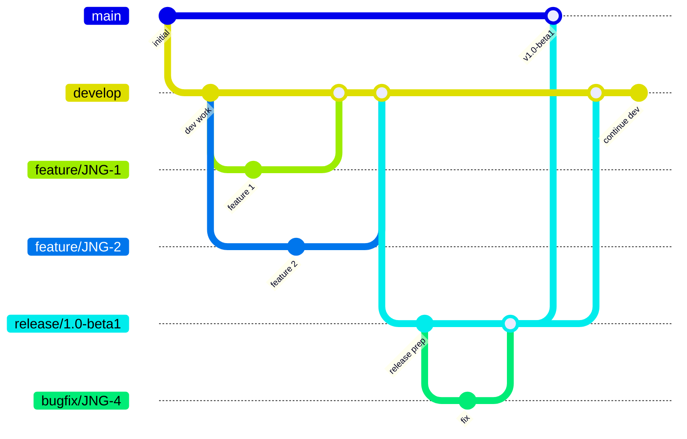
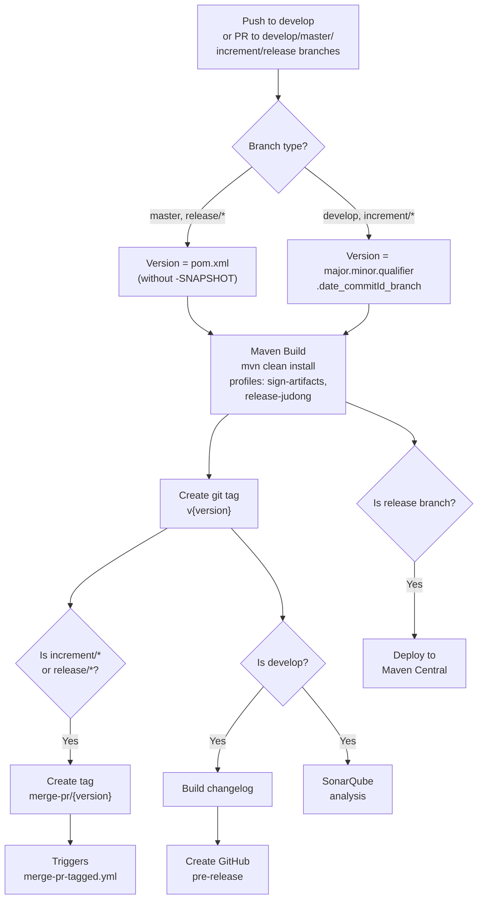
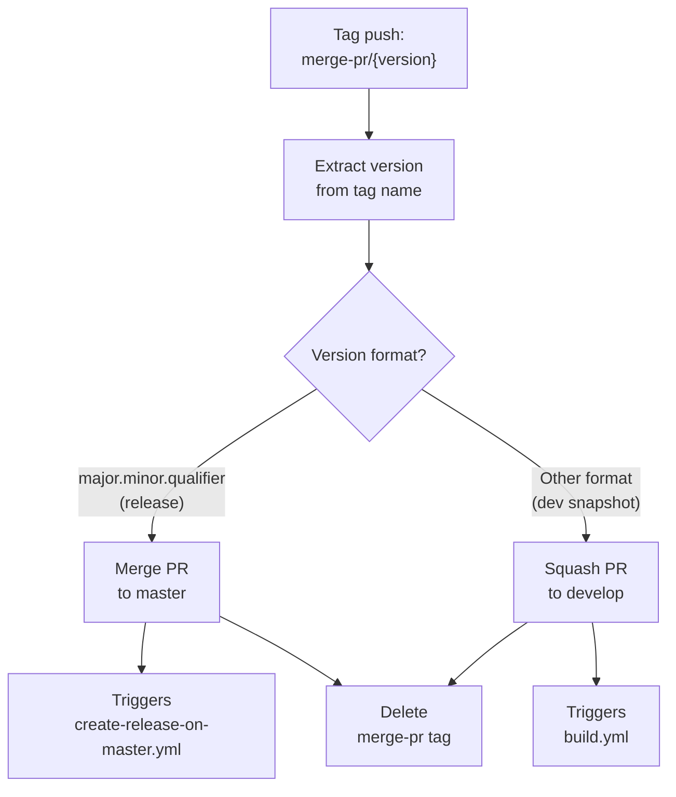
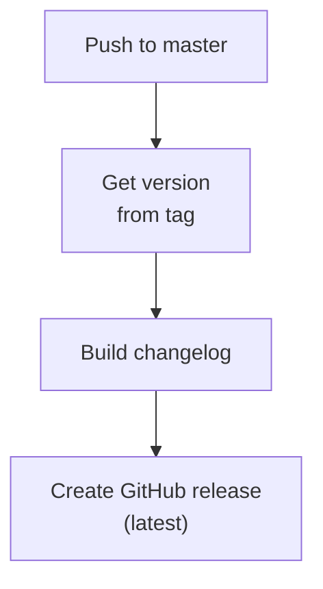
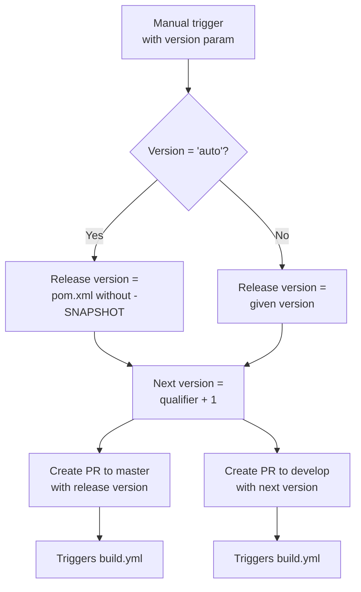

# Development Version and Branch Handling

This document describes the branching strategy, version numbering, and CI/CD pipeline for the EMF GenModel Generator project.

## Branches

The project follows a GitFlow-based branching model. Each branch type has a specific purpose and lifecycle:

| Branch Pattern | Base | Purpose |
|---------------|------|---------|
| `develop` | — | Main development branch. Contains latest development sources for the active version. |
| `feature/JNG-xxx_summary` | `develop` | New features being developed. Merged back into `develop` when complete. |
| `release/x.y.z` or `x_y_z` | `develop` | Release stabilization. Bug fixes are applied here before merging to `master`. The `release/` prefix is reserved for CI. |
| `bugfix/JNG-xxx_summary` | release branch | Fixes found during release testing. Must be applied to both the release branch and newer development branches. |
| `support/JNG-xxx_summary` | release branch | Minor changes for a previous release. Merged back to the release branch when the update ships. |
| `hotfix/JNG-xxx_summary` | `master` | Urgent fixes for production. Applied to both `master` and `develop`. |
| `master` | — | Latest released sources. Only receives merges from release and hotfix branches. |

## Version Numbers

Versions follow semantic versioning with these rules:

| Event | Version Change | Example |
|-------|---------------|---------|
| Start feature branch | No change | — |
| Start release branch | Bump 2nd number on `develop` | `1.1.0-SNAPSHOT` → `1.2.0-SNAPSHOT` |
| Start bugfix branch | No change | Applied during release testing |
| Start support branch | Bump 3rd number | `1.0.0` → `1.0.1` |
| Start hotfix branch | Bump 4th number | `1.0.0` → `1.0.0.1` |

## GitHub Actions Workflows

The CI/CD system is composed of several interconnected workflows. Each workflow triggers the next based on branch and tag conventions.

### build.yml — Main Build Pipeline

This is the primary workflow, triggered on every push to `develop` and on pull requests targeting `develop`, `master`, `increment/*`, or `release/*` branches.

### merge-pr-tagged.yml — Automatic PR Merge

Triggered when a `merge-pr/*` tag is pushed (by `build.yml`). Determines whether to merge to `master` or squash to `develop` based on the version format.

### create-release-on-master.yml — Production Release

Triggered when code is pushed to `master` (typically via merge from a release branch). Creates the final GitHub release with a changelog.

### release.yml — Release Orchestration

Manually triggered workflow that automates the release process. Accepts a version parameter (`auto` uses the POM version).

### Other Workflows

| Workflow | Trigger | Purpose |
|----------|---------|---------|
| `build-dependabot.yml` | Dependabot PRs | Separate handling for dependency update PRs |
| `bump-version.yml` | Manual | Updates POM versions across all modules |
| `create-release-tagged.yml` | Tag creation | Creates releases from tags |
| `delete-old-draft-releases.yml` | Scheduled | Cleans up stale draft releases |
| `jira-description-to-pr.yml` | PR events | Copies JIRA ticket descriptions into PR body |
| `sync-labels.yml` | Manual/scheduled | Syncs GitHub labels from `labels.yml` |

## Development Rules

> **Important:** Every commit must reference a JIRA ticket number. Use the format `JNG-xxx` in your commit message or PR title.

For issue tracking, the project uses [JIRA](https://blackbelt.atlassian.net/jira/dashboards).
