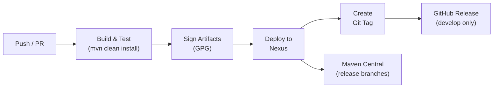

# Contributing to emf-genmodel-generator

## Development Environment

### Required Tools

| Tool | Version | Notes |
|------|---------|-------|
| Java JDK | 21 | [Zulu JDK](https://www.azul.com/downloads/?version=java-21-lts&package=jdk) recommended (used by CI) |
| Maven | 3.9.4+ | Or use the included `./mvnw` wrapper |
| Eclipse IDE | 2025-03+ | Optional, for Xtend/MWE2 development |

> **Note:** The `CONTRIBUTING.adoc` referenced Java 11 and Maven 3.8.x, but the project has since migrated to **Java 21** and **Maven 3.9.4+** as specified in `pom.xml`.

Verify your setup:

```bash
java -version
# Expected: openjdk version "21.x.x" ...

mvn -version
# Expected: Apache Maven 3.9.x ...
```

### Eclipse IDE Setup (optional)

If you're editing Xtend templates, Eclipse provides the best experience:

1. Install Xtext/Xtend plugins from Eclipse Marketplace
2. Import as "Existing Maven Projects"
3. The project uses Tycho (`eclipse-plugin` packaging), so Eclipse resolves OSGi bundles via P2 repositories

## Code Structure

This is a multi-module Maven/Tycho project. Each module is an Eclipse plugin (OSGi bundle):

```mermaid
graph TD
    subgraph "You'll mostly work in these"
        Core["core/<br/>Base engine classes"]
        Builder["builder/<br/>Builder templates"]
        Helper["helper/<br/>Helper templates"]
    end

    subgraph "Packaging (rarely touched)"
        Ecore["ecore/<br/>Self-hosted Ecore support"]
        Feature["feature/<br/>Eclipse feature"]
        Site["site/<br/>P2 update site"]
    end

    Builder -->|extends| Core
    Helper -->|extends| Core
    Ecore -->|uses| Builder
    Ecore -->|uses| Helper
    Feature -->|bundles| Core
    Feature -->|bundles| Builder
    Feature -->|bundles| Helper
    Feature -->|bundles| Ecore
    Site -->|publishes| Feature
```



Templates live in each generator module's `src/main/java/.../templates/` package as Xtend files. These are the primary files you'll modify when changing generated output.

## Build Commands

```bash
# Full build
./mvnw clean install

# Build a single module (faster iteration)
./mvnw clean install -pl builder

# Run tests (none currently exist, but the infrastructure is in place)
./mvnw clean test
```

## Submission Guidelines

### Submitting an Issue

Before filing, search the [issue tracker](https://github.com/BlackBeltTechnology/emf-genmodel-generator/issues) for existing reports.

When reporting a bug, include:
- Output of `java -version` and `mvn -version`
- Your `pom.xml` or `.flattened-pom.xml` (if applicable)
- A minimal reproduction case showing the failure

File new issues via the [issue form](https://github.com/BlackBeltTechnology/emf-genmodel-generator/issues/new/choose).

### Submitting a PR

This project uses [GitHub's forking model](https://guides.github.com/activities/forking/). Fork the repository, make your changes, and submit a pull request.

For details on the CI/CD pipeline and how PRs are built, tested, and merged, see the [CI Flow documentation](.github/CIFLOW.md).

## CI/CD Pipeline

The project uses GitHub Actions with a custom `judong` runner. The build workflow handles version calculation, artifact signing, deployment, and release creation automatically.



See [.github/CIFLOW.md](.github/CIFLOW.md) for the complete workflow documentation.
