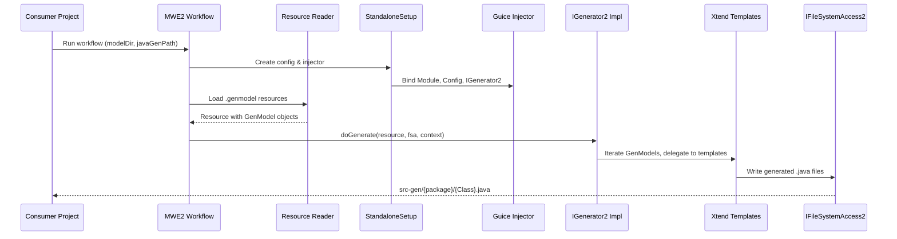
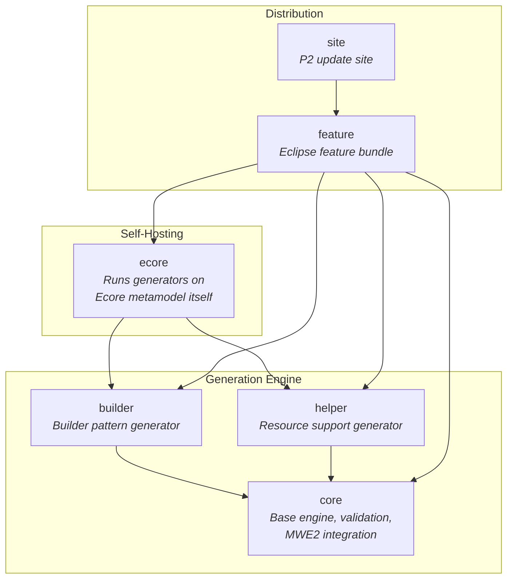
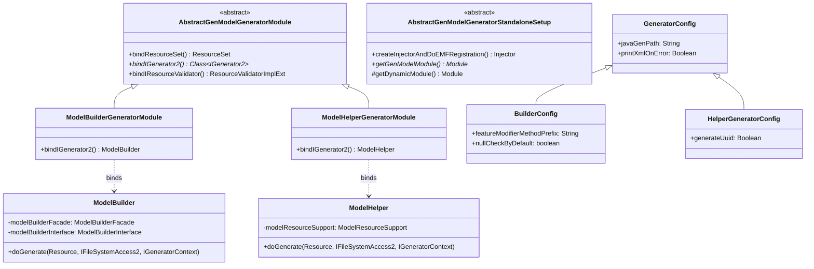
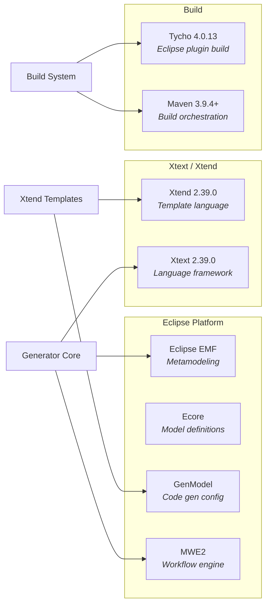

# EMF GenModel Generator

[](https://github.com/BlackBeltTechnology/emf-genmodel-generator/actions/workflows/build.yml)

The EMF GenModel Generator extends Eclipse Modeling Framework's standard code generation by automatically producing **Builder patterns** and **Helper utilities** from GenModel (`.genmodel`) files. It runs as a set of Eclipse plugins, distributed via a P2 update site, and integrates into MWE2 (Model Workflow Engine) workflows used by downstream metamodel projects.

## How It Works

Consumer projects (such as `judo-meta-esm`, `judo-meta-psm`, `judo-meta-rdbms`) define an Ecore metamodel and a corresponding GenModel. They invoke this generator's MWE2 workflow components to produce additional Java source code alongside EMF's standard output.

The generation pipeline follows this sequence:



## Modules

This project is organized into six modules. The generator modules (`core`, `builder`, `helper`) form the generation engine, while the remaining modules handle packaging and self-hosting.



| Module | Packaging | What it produces |
|--------|-----------|-----------------|
| `core` | eclipse-plugin | Base classes: `AbstractGenModelGeneratorModule`, `AbstractGenModelGeneratorStandaloneSetup`, `GeneratorConfig`, validation framework |
| `builder` | eclipse-plugin | `{ClassName}Builder.java` (fluent builders), `{Package}Builders.java` (facade), `I{Package}Builder.java` (interface) |
| `helper` | eclipse-plugin | `{Model}ModelResourceSupport.java` with stream-based model access, resource loading, and factory methods |
| `ecore` | eclipse-plugin | Pre-generated builder and helper code for the Ecore metamodel itself |
| `feature` | eclipse-feature | Bundles all four plugins into an installable Eclipse feature |
| `site` | eclipse-repository | P2 update site for Eclipse Marketplace distribution |

## Generated Code Examples

### Builder Pattern

For each concrete EClass in a GenModel, the builder generator produces a fluent API:

```java
Customer customer = CustomerBuilder.create()
    .withName("John Doe")
    .withEmail("john@example.com")
    .withAddress(AddressBuilder.create()
        .withCity("New York")
        .build())
    .build();
```

### Helper / Resource Support

For each GenModel, the helper generator produces stream-based access utilities:

```java
ModelResourceSupport support = MyModelModelResourceSupport.myModelModelResourceSupportBuilder()
    .resourceSet(resourceSet)
    .build();

// Stream all instances of a type
support.getStreamOfMyModelCustomer()
    .filter(c -> c.getName() != null)
    .forEach(System.out::println);
```

## Class Architecture

Each generator module follows the same five-layer pattern, with core providing the abstract base:



## Build

```bash
# Full build (requires Java 21, Maven 3.9.4+)
./mvnw clean install

# Skip tests (there are currently no unit tests)
./mvnw clean install -DskipTests

# Build a single module
./mvnw clean install -pl builder
```

> **Note:** JVM memory is pre-configured in `.mvn/jvm.config` (1-2 GB heap). The build uses Tycho 4.0.13 for Eclipse plugin packaging.

## External Dependencies



## Contributing

See [CONTRIBUTING.md](CONTRIBUTING.md) for development setup, submission guidelines, and CI workflow details.

## License

This project is licensed under the [Eclipse Public License 2.0](https://www.eclipse.org/org/documents/epl-2.0/EPL-2.0.txt).
